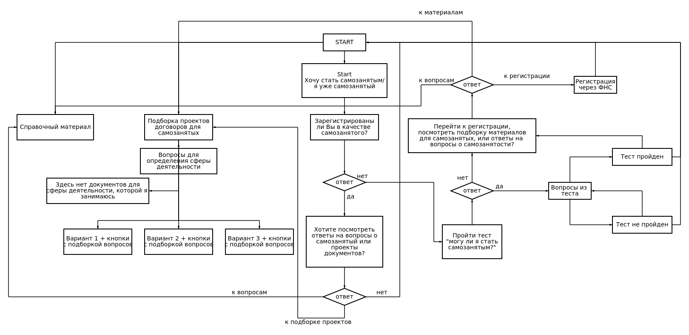

# Чат-бот "Я всё сам"
 
 Схема работы чат бота:



## Инструкция по запуску бота
#### Ubuntu
##### Бэкенд
Версия python на момент разработки: ```python3.8```\
Установка всех необходимых пакетов для бэкенд части командой:```pip install -r requirements.txt```
Запуск бэкенда:

```bash
cd ./backend
make
```

Или

```bash
cd ./backend
poetry install
poetry run start
```
##### Фронтенд
Установка Nodejs: ```sudo apt install nodejs```\
Установка последней версии Nodejs:
```bash
sudo npm install -g n
n latest
```
```hash -r``` если node -v выдает старую версию (версия на момент разработки v18.10.0).\
Далее:

```bash
cd ./frontend
make
```

Или

```bash
cd ./frontend
npm i
npm run dev
```

#### Windows
##### Бэкенд
Установка необходимых пакетов аналогично ubuntu.\
Запуск бэкенда:
```bash
cd ./backend
poetry install
poetry run start
```
##### Фронтенд
[Установка](https://nodejs.org/en/download/) Nodejs.\
Установка последней версии Nodejs:
```bash
sudo npm install -g n
n latest
```
```hash -r``` если node -v выдает старую версию (версия на момент разработки v18.10.0).\
Далее:
```bash
cd ./frontend
npm i
npm run dev
```

## Документация
Документация (на данный момент): [URL](http://localhost:9191/ws/docs)
